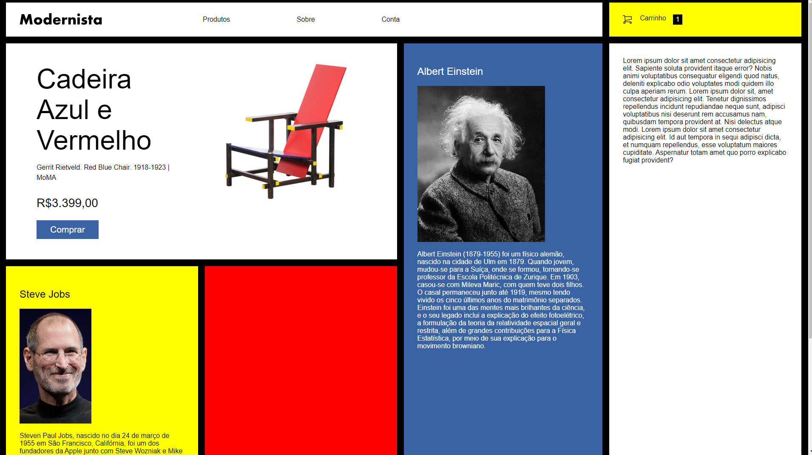

## Grid layout gallery

<h3>✍️Aprendizado</h3>

Pude utilizar esse recurso do CSS3 neste projeto, descobrindo suas principais funções e comandos, como grid-template-row/column, grid-auto-row, gap, técnicas de alinhamentos, etc.

🔗[Clique aqui para acessar](https://pedrodevvv.github.io/grid_layout_gallery/)
## 🛠️Tecnologias

* HTML
* CSS
* Visual Studio Code

## 📞 Contato

📩E-mail: pedrohgs2004@gmail.com  
🌐Linkedin: https://www.linkedin.com/in/pedro-henrique-g-silva-a2100a23a/?originalSubdomain=br
